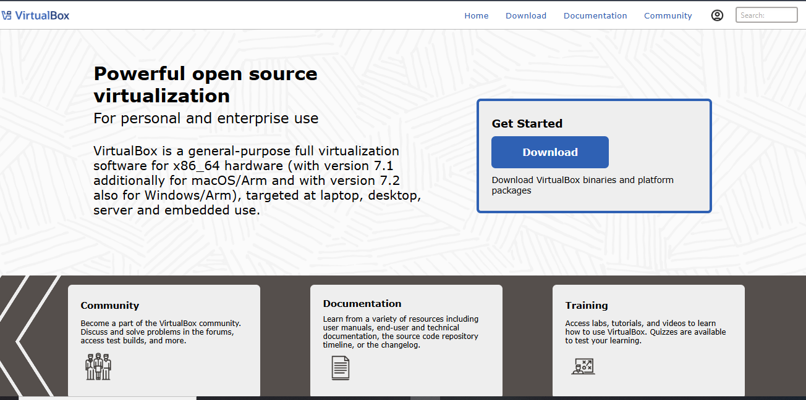
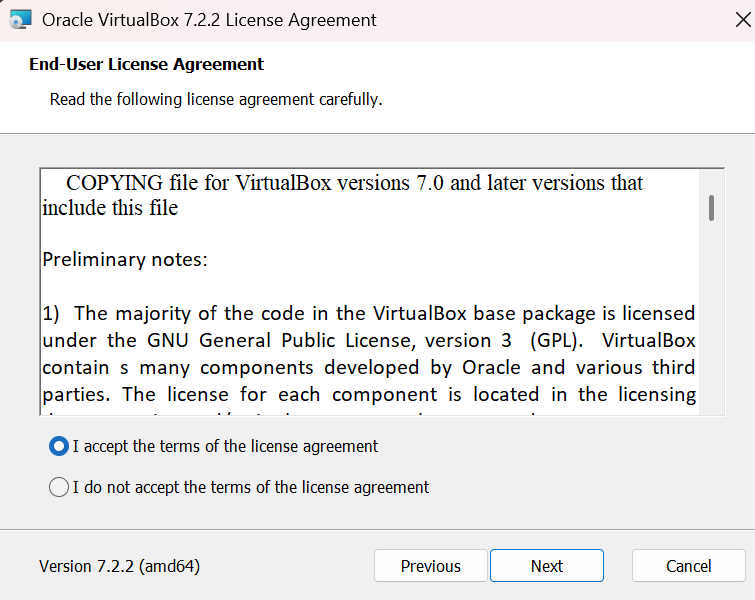
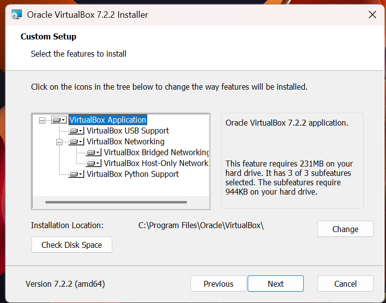
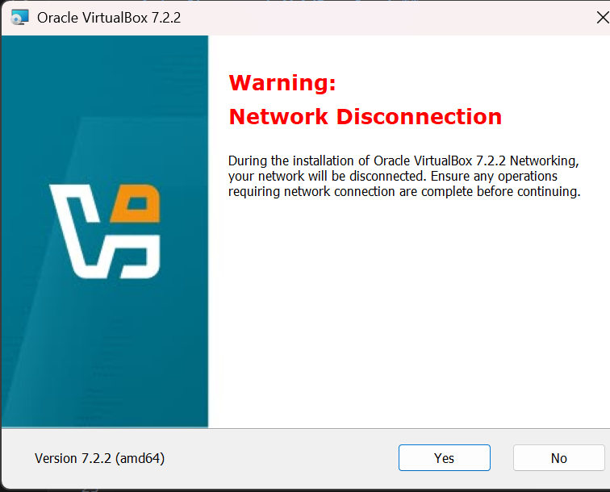
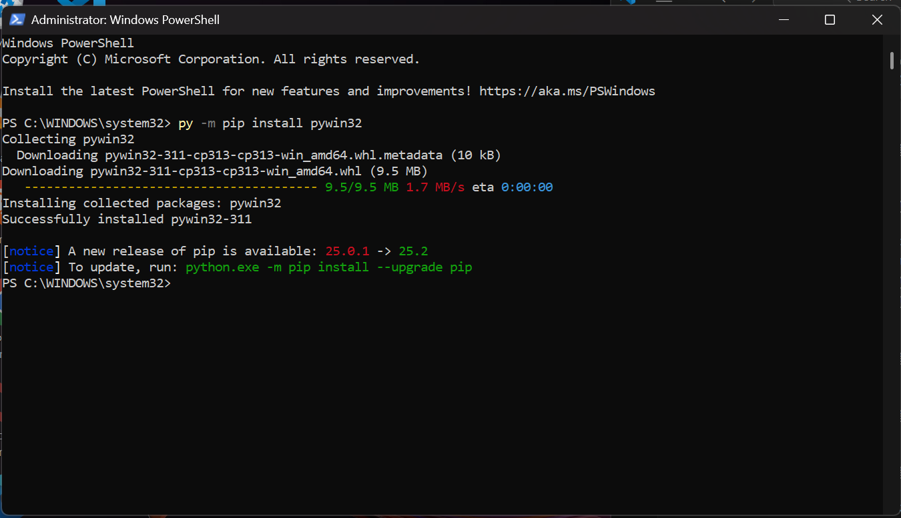
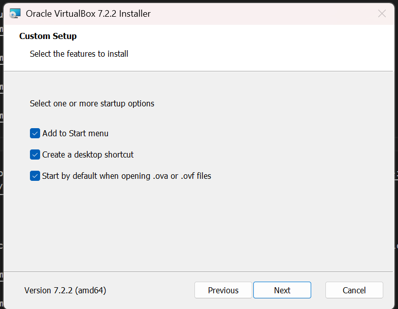
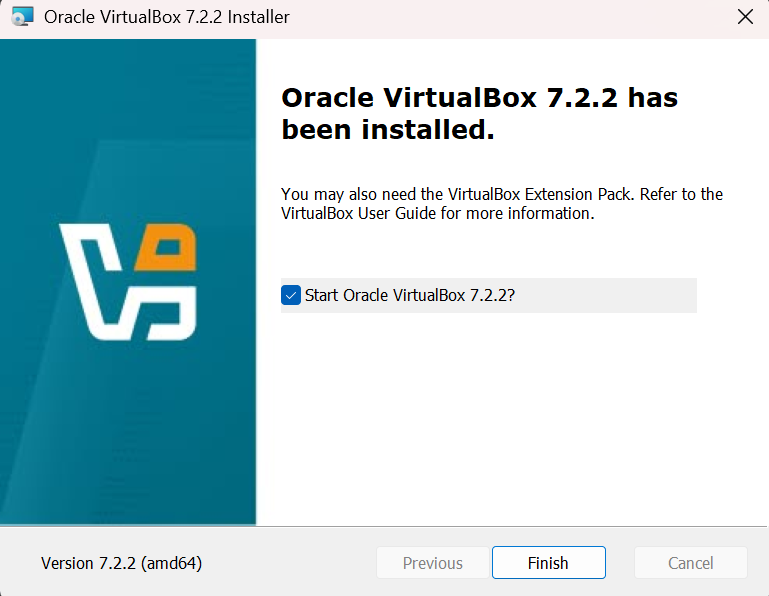
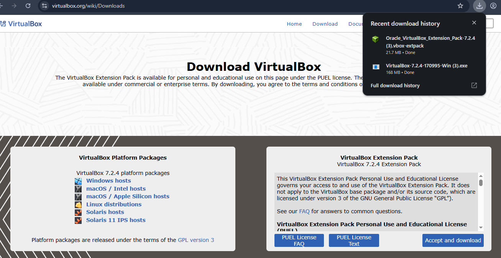

step:1  Install VirtualBox
        URL link:
        https://www.virtualbox.org/wiki/Downloads  
                       
 click on"Download"
         
 Open "VirtualBox-7.2.4-170995-Win"
         
click "Next"
          
click "Next"
         
click on "Next"
        
click on "yes"
        
some issuses to see 
click on "yes"
        
step:4
     To run cmd as administator and run py -m pip install pywin32  
     Go to the command prompt
         
click on "Next"
         
click on "Finish"
          

click on
         
click on
                              